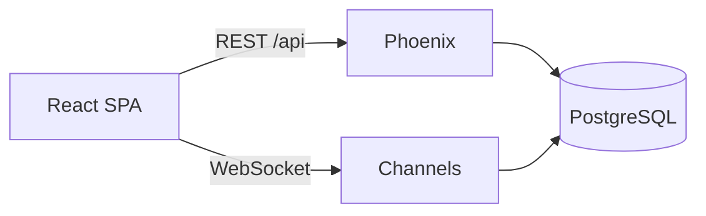
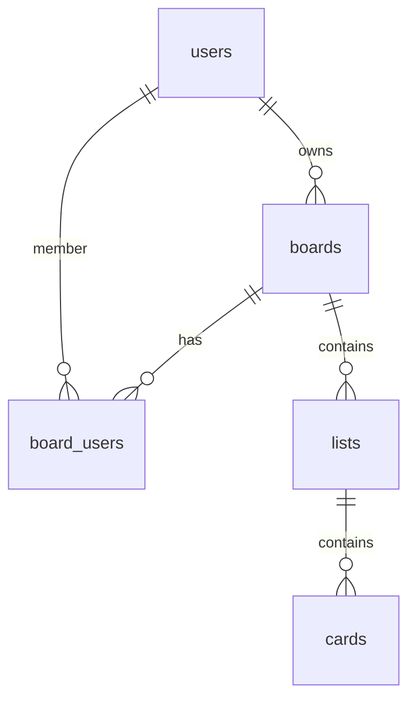

## 5.1 Выбранный проект

**Название:** Trello Clone (Phoenix + React)

**Ссылка на проект в каталоге: https://bigardone.dev/blog/2016/01/04/trello-tribute-with-phoenix-and-react-pt-1/ ** 

**Описание:** Одностраничное веб-приложение для управления задачами. Пользователь регистрируется, создаёт доски, приглашает участников, добавляет списки и карточки. Изменения синхронизируются в реальном времени через WebSocket.

**Реализовано:**

- Регистрация и авторизация
- CRUD досок, списков, карточек
- Совместный доступ к доскам
- Real-time (Phoenix Channels, Presence)
- Drag-and-drop списков и карточек

## 5.2 Технический паспорт проекта

| Параметр | Значение |
|----------|----------|
| GitHub | https://github.com/nikitaved123/Clone-Trello |
| Деплой | https://clone-trello.onrender.com |
| Backend | Elixir, Phoenix 1.7, Ecto |
| Frontend | React 18, Redux Toolkit, Vite |
| БД | PostgreSQL |
| Login | alice |
| Password | password123 |

## 5.3 Архитектура

### Схема

### ERD

### Use Case

1. Регистрация и вход
2. Создание и управление досками
3. Списки и карточки на доске
4. Совместная работа в real-time

### API

| Метод | Путь | Назначение |
|-------|------|------------|
| POST | /api/registrations | Регистрация |
| POST | /api/sessions | Вход |
| GET | /api/sessions/current | Текущий пользователь |
| DELETE | /api/sessions | Выход |
| GET | /api/boards | Список досок |
| GET | /api/boards/:id | Доска |
| POST | /api/boards | Создать доску |
| PATCH | /api/boards/:id | Обновить доску |
| DELETE | /api/boards/:id | Удалить доску |
| POST | /api/boards/:id/invite | Пригласить участника |
| POST | /api/boards/:board_id/lists | Создать список |
| PATCH | /api/lists/:id | Обновить список |
| DELETE | /api/lists/:id | Удалить список |
| POST | /api/lists/:list_id/cards | Создать карточку |
| PATCH | /api/cards/:id | Обновить карточку |
| DELETE | /api/cards/:id | Удалить карточку |
| WS | /socket board:ID | Real-time события |

## 5.4 Таблица соответствия

| Функция | GitHub | Деплой |
|---------|--------|--------|
| Регистрация | client/src/pages/Register.jsx | /register |
| Вход | client/src/pages/Login.jsx | /login |
| Список досок | client/src/pages/Home.jsx | / |
| Создание доски | client/src/pages/Home.jsx | / |
| Экран доски | client/src/pages/Board.jsx | /boards/:id |
| CRUD списков | client/src/pages/Board.jsx, lib/trello_clone_web/controllers/list_controller.ex | /boards/:id |
| CRUD карточек | client/src/pages/Board.jsx, lib/trello_clone_web/controllers/card_controller.ex | /boards/:id |
| Приглашение участника | client/src/pages/Board.jsx, lib/trello_clone_web/controllers/board_controller.ex | /boards/:id |
| Real-time | client/src/socket.js, lib/trello_clone_web/channels/ | /boards/:id |
| Drag-and-drop | client/src/pages/Board.jsx | /boards/:id |

## 5.5 Демонстрация работы

Формат: GIF / видео (до 2 минут)

Демонстрация: вход → создание доски → списки и карточки → совместная работа двух пользователей в real-time.

## 5.6 Качество кода

Бейдж Code Climate в README.md (оценка A или B).

## 5.7 Вывод по практике

Реализован Trello-клон на Phoenix и React с PostgreSQL, REST API и WebSocket-синхронизацией.

Изучены: архитектура Phoenix, Ecto, React + Redux, интеграция frontend и backend, деплой full-stack приложения.
